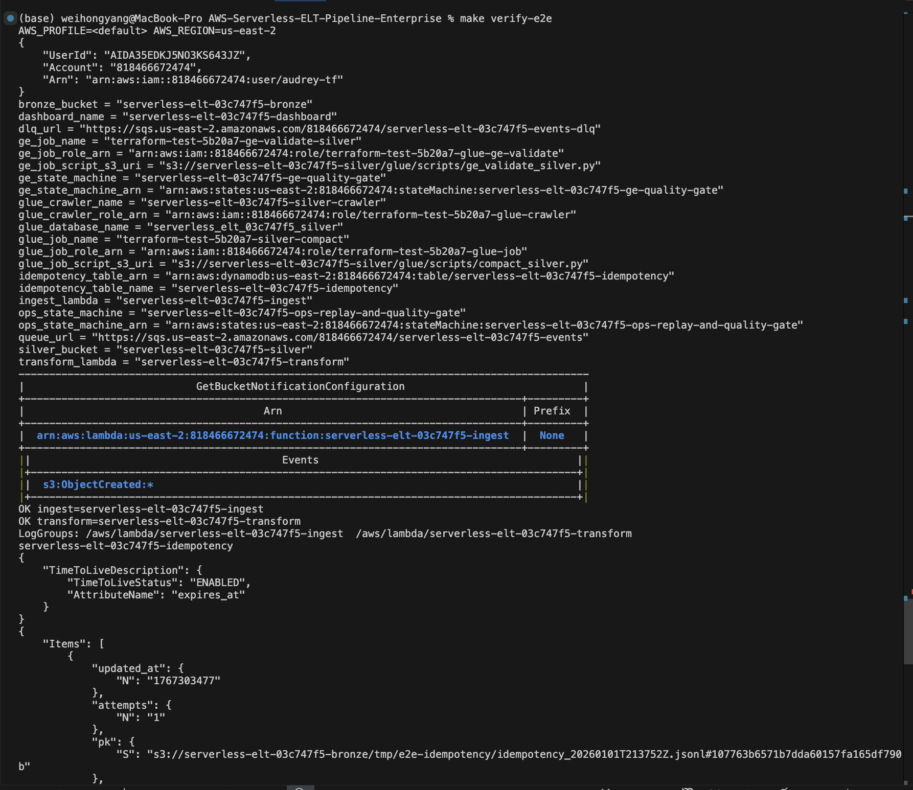
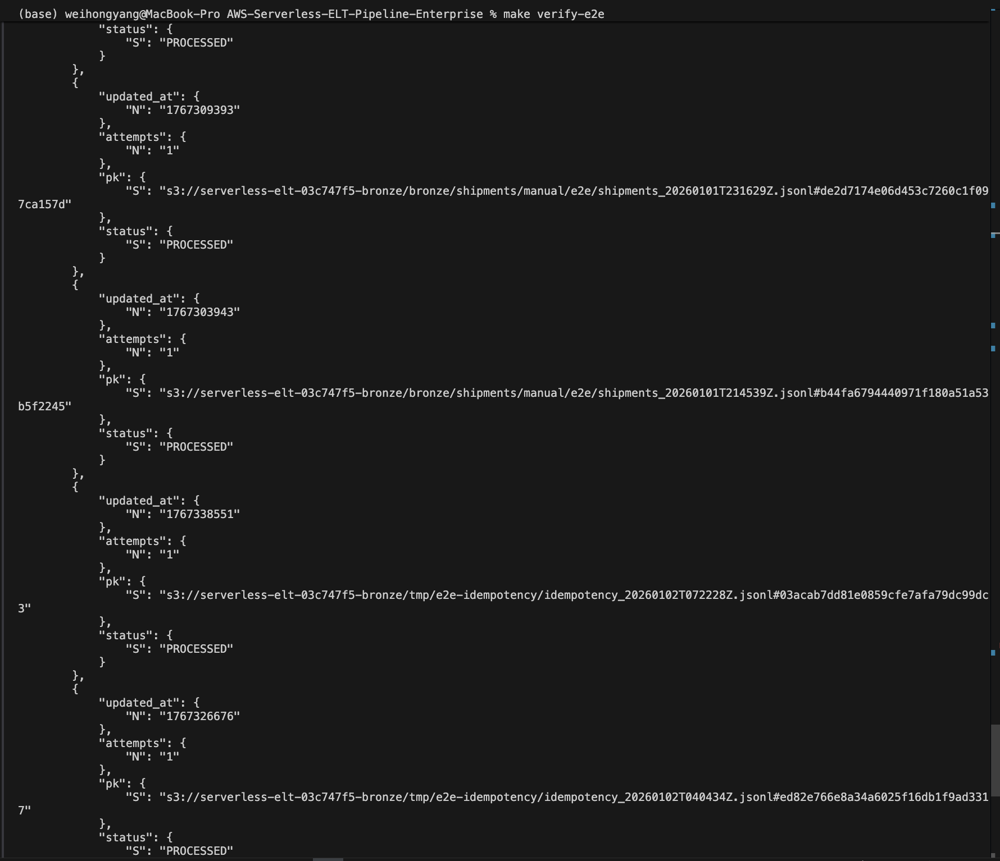
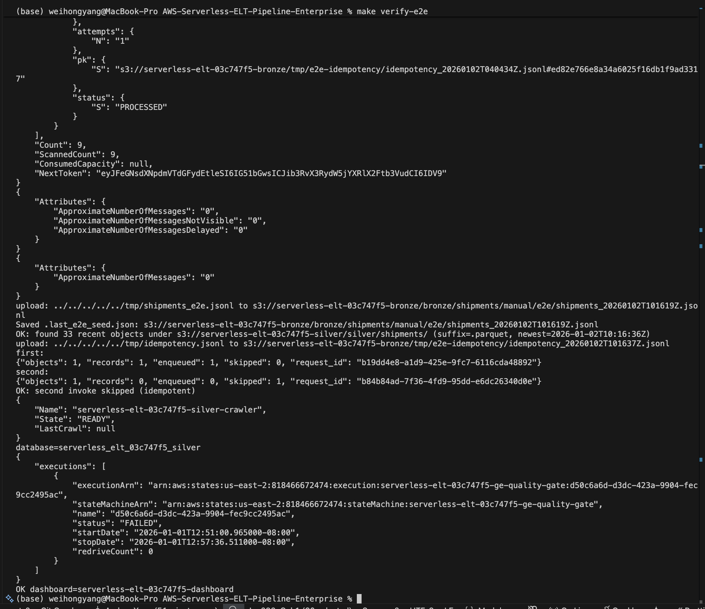

# AWS Serverless ELT Pipeline (v2.0 — Enterprise)


## Project Summary

Built a end to end production-lite, serverless ELT framework on AWS (S3 bronze JSONL → Lambda ingest → SQS (+ DLQ) → Lambda transform → S3 silver Parquet) with optional orchestration, catalog/query, quality gates, and observability.

**Highlights**

- Implemented object-level idempotency using AWS Lambda Powertools Idempotency backed by DynamoDB (conditional writes + TTL) to prevent duplicate ingestion across retries and duplicate events.
- Designed for reliability with SQS partial batch failure handling, DLQ + redrive tooling, and S3-copy replay for backfills without direct queue access.
- Produced query-ready Parquet outputs and integrated optional Glue Data Catalog/Crawler so Athena can query the silver layer as tables.
- Added optional operational workflows (Step Functions) to orchestrate replay/backfill and downstream readiness/quality checks (with optional EventBridge auto-triggering).
- Delivered infrastructure as code (Terraform modules) and CI automation (pytest + terraform fmt checks; manual Terraform plan/apply workflow supporting OIDC or access keys).


## Architecture

```text

(1) Ingest path (always-on)
S3 Bronze (jsonl) 
  -> S3:ObjectCreated 
  -> Lambda Ingest (Powertools logs/metrics + DDB idempotency)
  -> SQS Events (DLQ optional)
  -> Lambda Transform (batch + partial batch failure)
  -> S3 Silver (parquet)

(2) Query path (optional, consumes Silver)
S3 Silver (parquet)
  -> Glue Crawler / Data Catalog
  -> Athena (SQL query)

(3) Ops/DQ path (optional, operates on Silver)
S3 Silver (parquet)
  -> Step Functions
  -> Glue Job (compaction / recompute) 
  -> (optional) Great Expectations validation gate


### Architecture (straight-line)

S3 (bronze/*.jsonl)
  └─ ObjectCreated
     └─ Lambda ingest
         ├─ Powertools: Logger / Metrics
         ├─ Powertools Idempotency (DynamoDB, key = bucket/key#etag, TTL)
         └─ SQS (events) [+ DLQ optional]
             └─ Lambda transform (Parquet writer)
                 ├─ Powertools: Logger / Metrics
                 └─ S3 (silver/…/*.parquet)
                     ├─ (optional) Glue Catalog/Crawler → Athena (query as tables)
                     └─ (optional) EventBridge → Step Functions → Glue Job (+ optional Great Expectations gate)


### Architecture (with optional branches)

S3 (bronze/*.jsonl)
  └─ Lambda ingest (Powertools logs/metrics + idempotency via DynamoDB TTL)
      └─ SQS (events) + DLQ (optional)
          └─ Lambda transform (Parquet writer; Powertools logs/metrics)
              └─ S3 (silver/…/*.parquet)
                  ├─ Branch A (Queryability, optional)
                  │    └─ Glue Catalog/Crawler → Athena tables
                  └─ Branch B (Ops / DQ workflows, optional)
                       └─ EventBridge → Step Functions
                             └─ Task: Glue Job (+ optional Great Expectations gate)

```

No VPC/EC2 is required for the minimal path.

## What’s included

- **Idempotency:** AWS Lambda Powertools Idempotency backed by DynamoDB (conditional writes + TTL under the hood).
- **Replay/Recovery:** `scripts/replay.sh` (S3-copy replay) + `scripts/redrive.sh` (SQS native redrive).
- **Ops orchestration (optional):** Step Functions workflow for replay/backfill + downstream readiness polling.
- **Catalog/Query (optional):** Glue Data Catalog + Crawler to query `silver/` Parquet in Athena.
- **Quality gate (optional):** Glue Job + Step Functions (optionally auto-triggered via EventBridge).
- **Observability (optional):** CloudWatch Dashboard + Alarms.
- **Delivery:** Terraform modules + GitHub Actions (CI + manual Terraform plan/apply).

## Why “optional” is emphasized

This repo is designed so you can keep a minimal, low-cost baseline (the core S3→Lambda→SQS→Lambda→S3 pipeline) and enable “enterprise” capabilities via Terraform toggles. Marking modules as **optional** avoids misunderstandings when:

- You intentionally keep a capability off (cost, complexity, or permissions).
- Your org policies block certain APIs (for example, CloudWatch dashboard/alarm writes).
- You want to demonstrate the architecture and toggles without implying every deployment has every module enabled.

## v1 vs v2.0

| Aspect | v1 (Minimal) | v2.0 (Production-ready / Enterprise track) |
|---|---|---|
| Core pipeline | S3 (bronze JSONL) → Lambda ingest → SQS → Lambda transform → S3 (silver Parquet) | Same core pipeline (keeps it simple & scalable) |
| Triggers & orchestration | S3 trigger + SQS event source mapping | Same, plus optional Step Functions workflows (manual by default; optional EventBridge schedule/auto-trigger) |
| Idempotency | Object-level idempotency (DynamoDB + TTL; key = `s3://bucket/key#etag`) | Powertools Idempotency backed by DynamoDB (conditional writes + TTL; same key) |
| Failure handling | Default retries | SQS partial batch failure handling + DLQ (optional) + replay/redrive scripts (`scripts/replay.sh`, `scripts/redrive.sh`) |
| Recovery / backfill | Manual replay (ad-hoc) | Repeatable replay/backfill loop (S3-based replay + DLQ redrive), designed for safe reprocessing |
| Storage format | JSONL → Parquet | JSONL → Parquet with partitioned silver layout (query-friendly) |
| Queryability | S3 files only | Optional Glue Catalog/Crawler → Athena tables over `silver/<record_type>/dt=.../*.parquet` |
| Data quality | — | Optional Step Functions task → Glue Job (+ optional Great Expectations gate) |
| Observability | Logs only | Powertools Logger + Metrics + optional CloudWatch Dashboard + Alarms |
| IaC / deployment | Terraform apply locally | Terraform modules + CI checks (pytest + terraform fmt) + manual Terraform plan/apply workflow (OIDC preferred; access keys supported) |
| Extensibility | Manual wiring per dataset | Dataset scaffold (`make scaffold DATASET=...`) generates config/handler/DQ/sample skeletons for new datasets |

## Quickstart 

```bash

git clone https://github.com/wyang10/AWS-Serverless-ELT-Pipeline-Enterprise.git
cd AWS-Serverless-ELT-Pipeline-Enterprise

python3 -m venv .venv && source .venv/bin/activate
python -m pip install -U pip
python -m pip install -r requirements-dev.txt

export AWS_REGION=us-east-2
export AWS_DEFAULT_REGION=us-east-2
aws sts get-caller-identity

make build
make tf-init
TF_AUTO_APPROVE=1 make tf-apply

```

Run end-to-end verification (screenshot-able checks):

```bash
make verify-e2e
```

For the full E2E checklist and troubleshooting, see `Instructions.md`.

## Feature toggles in Terraform

Edit `infra/terraform/envs/dev/dev.tfvars`:

- `observability_enabled`: CloudWatch dashboard + alarms
- `ops_enabled`: ops Step Functions workflow (replay + polling)
- `glue_enabled`: Glue database + crawler (Athena tables)
- `glue_job_enabled`: compaction/recompute Glue job
- `ge_enabled`: Great Expectations Glue job + state machine (quality gate)
- `ge_workflow_enabled`: Step Functions quality gate workflow
- `ge_emit_events_from_transform`: have `transform` emit EventBridge events after success
- `ge_eventbridge_enabled`: create an EventBridge rule to auto-start the GE workflow

Recommendation: keep `ge_emit_events_from_transform=false` and `ge_eventbridge_enabled=false` until you’re ready to run the gate automatically (and handle failures/quarantine paths).

## Common ops commands

- Deploy: `make build && TF_AUTO_APPROVE=1 make tf-apply`
- Destroy: `TF_AUTO_APPROVE=1 make tf-destroy` (empty S3 buckets first; details in `Instructions.md`)
- Start ops workflow: `make ops-start` (then `make ops-status`)
- Run Glue crawler: `make glue-crawler-start`
- Run compaction job: `make glue-job-start GLUE_RECORD_TYPE=shipments GLUE_DT=2025-12-31 GLUE_OUTPUT_PREFIX=silver_compacted`
- Run GE gate: `make ge-start GE_RECORD_TYPE=shipments GE_DT=2025-12-31`

## Repo layout 

```text

.
├─ .github/workflows/                 # CI + manual terraform workflow
├─ infra/terraform/
│  ├─ backend/backend.hcl
│  ├─ envs/dev/                       # entrypoint env (dev.tfvars, outputs.tf)
│  └─ modules/                        # reusable IaC modules
├─ lambdas/
│  ├─ ingest/app.py                   # S3 event → SQS (idempotent)
│  ├─ transform/app.py                # SQS batch → Parquet in S3
│  ├─ workflows/                      # Step Functions task Lambdas
│  └─ shared/                         # shared helpers/schema
├─ scripts/                           # replay/redrive/scaffold/verification helpers
├─ templates/                         # dataset scaffolding templates
├─ configs/                           # dataset configs (scaffolded)
├─ dq/                                # lightweight DQ rules (scaffolded)
├─ data_samples/                      # sample JSONL (scaffolded)
├─ demo/                              # screenshots
├─ Instructions.md
└─ LICENSE

```

## Screenshots





## License

MIT — see `LICENSE`.

